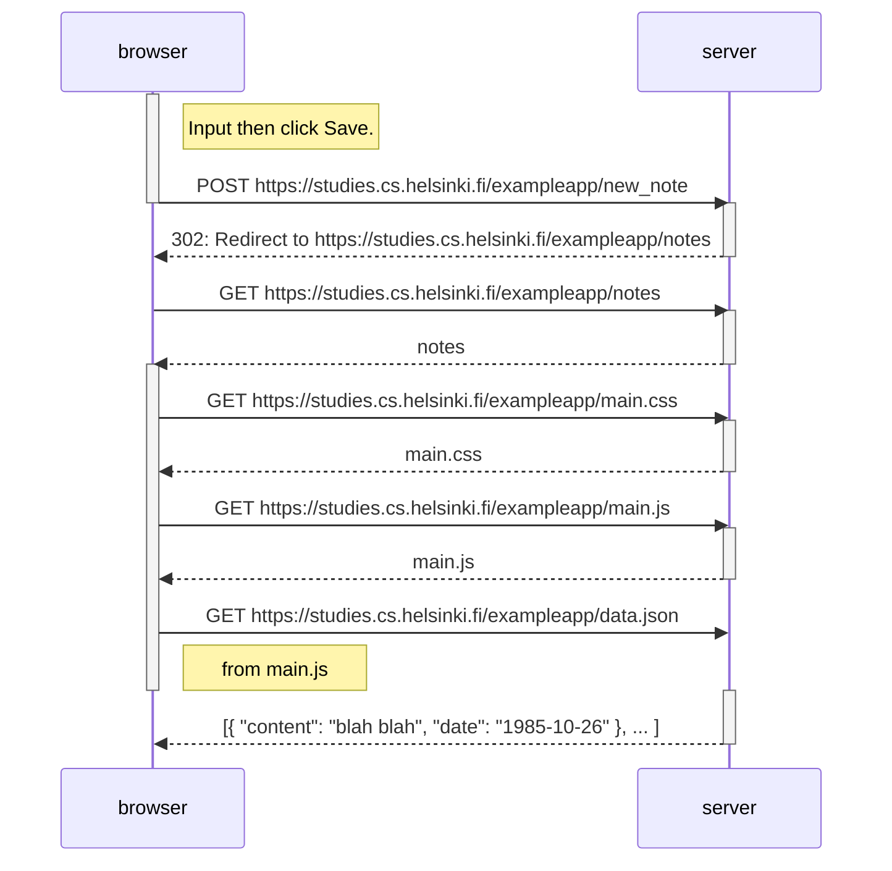

```mermaid
    sequenceDiagram
        participant browser
        participant server

        activate browser
        note right of browser: Input then click Save.
        browser->>server: POST https://studies.cs.helsinki.fi/exampleapp/new_note
        deactivate browser
        activate server
        server-->>browser: 302: Redirect to https://studies.cs.helsinki.fi/exampleapp/notes
        deactivate server
        browser->>server: GET https://studies.cs.helsinki.fi/exampleapp/notes
        activate server
        server-->>browser: notes
        deactivate server
        activate browser

        browser->>server: GET https://studies.cs.helsinki.fi/exampleapp/main.css
        
        activate server
        server-->>browser: main.css
        deactivate server

        browser->>server: GET https://studies.cs.helsinki.fi/exampleapp/main.js
        activate server
        server-->>browser: main.js
        deactivate server

        browser->>server: GET https://studies.cs.helsinki.fi/exampleapp/data.json
        note right of browser: from main.js
        deactivate browser
        activate server
        server-->>browser: [{ "content": "blah blah", "date": "1985-10-26" }, ... ]
        deactivate server
```