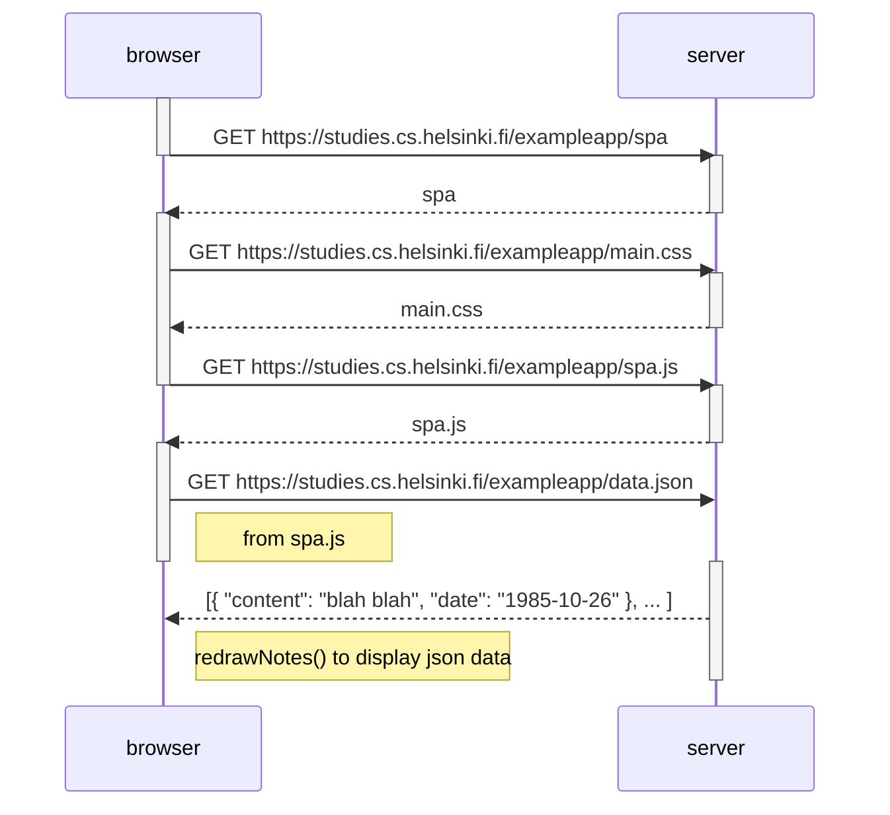

```mermaid
    sequenceDiagram
        participant browser
        participant server

        activate browser
        browser->>server: GET https://studies.cs.helsinki.fi/exampleapp/spa
        deactivate browser
        activate server
        server-->>browser: spa
        deactivate server
        
        activate browser
        browser->>server: GET https://studies.cs.helsinki.fi/exampleapp/main.css
        activate server
        server-->>browser: main.css
        deactivate server

        browser->>server: GET https://studies.cs.helsinki.fi/exampleapp/spa.js
        deactivate browser
        activate server
        server-->>browser: spa.js
        deactivate server

        activate browser
        browser->>server: GET https://studies.cs.helsinki.fi/exampleapp/data.json
        note right of browser: from spa.js
        deactivate browser
        activate server
        server-->>browser: [{ "content": "blah blah", "date": "1985-10-26" }, ... ]
        note right of browser: redrawNotes() to display json data
        deactivate server

        
```