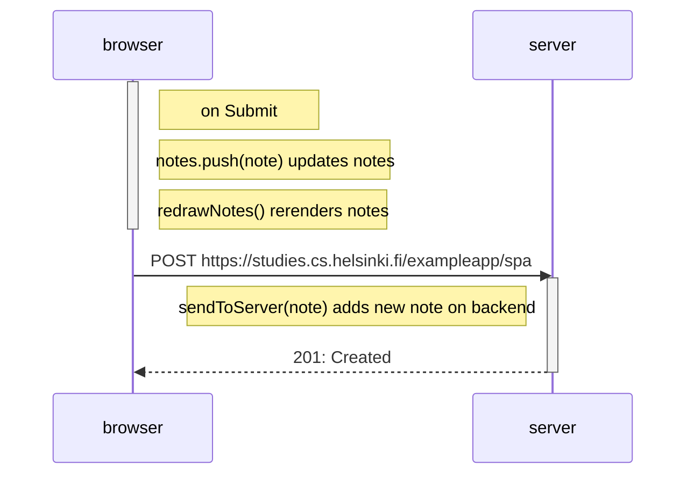

```mermaid
    sequenceDiagram
        participant browser
        participant server

        activate browser
        note right of browser: on Submit
        note right of browser: notes.push(note) updates notes
        note right of browser: redrawNotes() rerenders notes
        deactivate browser
        browser->>server: POST https://studies.cs.helsinki.fi/exampleapp/spa
        activate server
        note left of server: sendToServer(note) adds new note on backend
        server-->>browser: 201: Created
        deactivate server
```